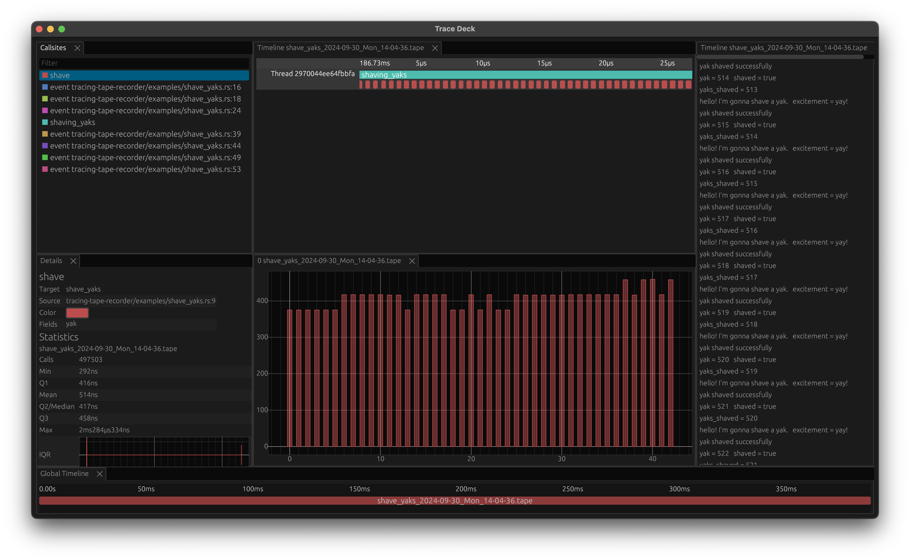

# Tracing Tape
Dead-simple debugging and profiling of Rust applications using the [tracing](https://docs.rs/tracing) crate.
Record trace files and view them within within seconds without complex setup or configuration.

[](trace-deck.png)

## Setup
1. Add the following dependencies to your application: `cargo add tracing tracing-subscriber tracing-tape-recorder`.
2. Add the following code to your application:
```rust
use tracing_subscriber::layer::SubscriberExt;
use tracing_tape_recorder::TapeRecorder;

let subscriber = tracing_subscriber::Registry::default().with(TapeRecorder::default());
tracing::subscriber::set_global_default(subscriber).expect("setting default subscriber failed");
```
Running your application will now generate a `{name}-{timestamp}.tape` file in the current working directory.

## Viewing Tape Files
You can use the `trace-deck` application to view the recorded tape files either by running `trace-deck filename.tape` or by dragging the files into the window.
You can load multiple files simultaneously which can be useful for analyzing workflows across multiple applications (e.g., client-server interactions).

## Crates
- tracing-tape: defines the format of the tape files.
- tracing-tape-recorder: records trace events to tape files.
- tracing-tape-parser: parses recorded tape files.
- trace-deck: GUI application for viewing tape files.
